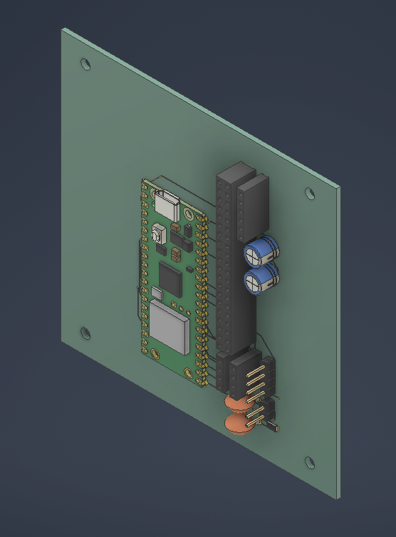
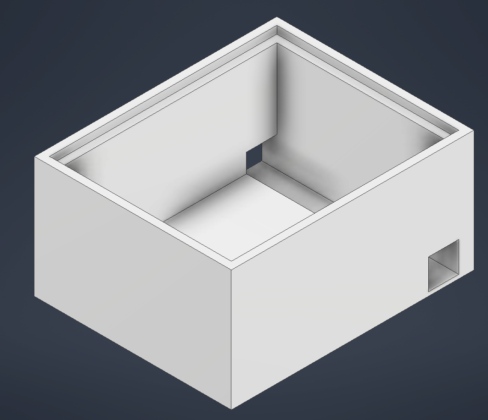
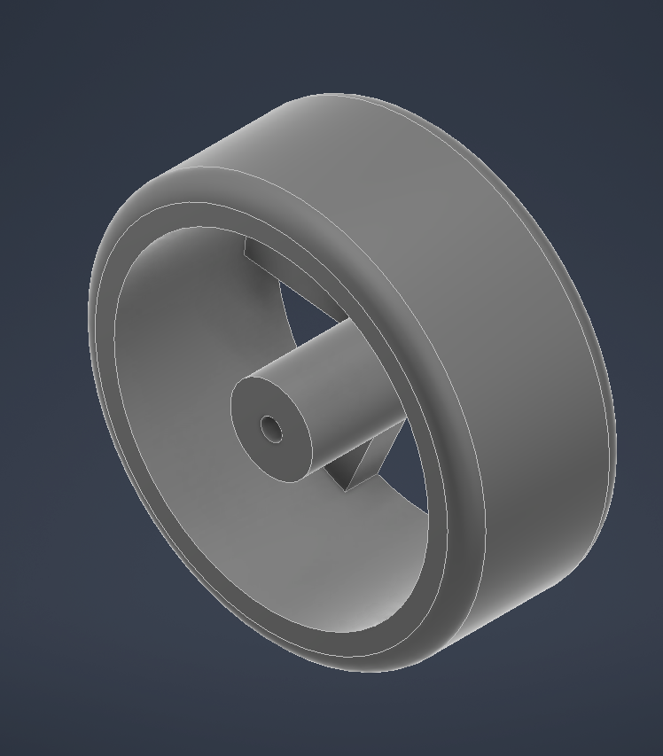
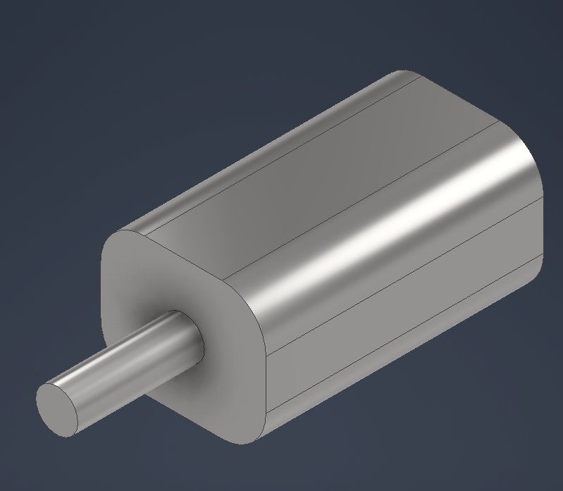
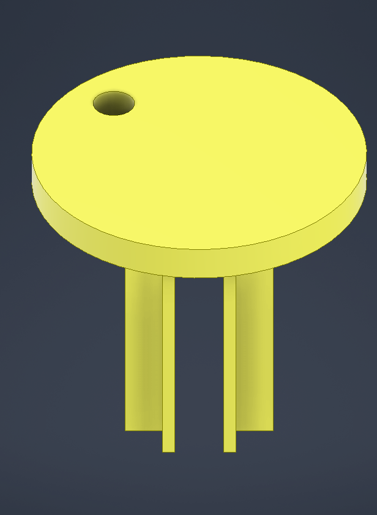
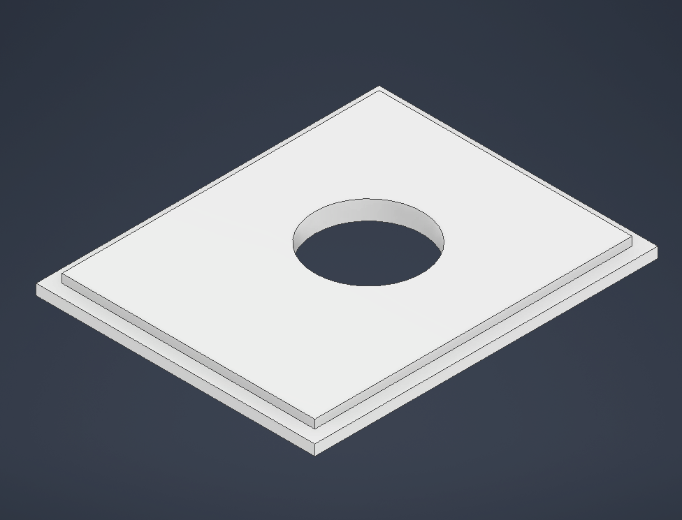
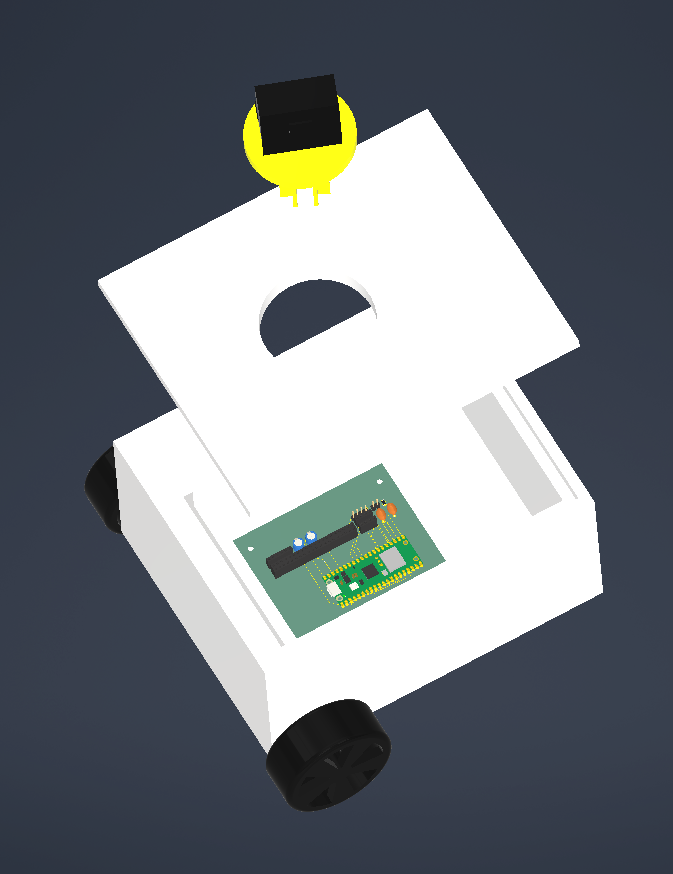
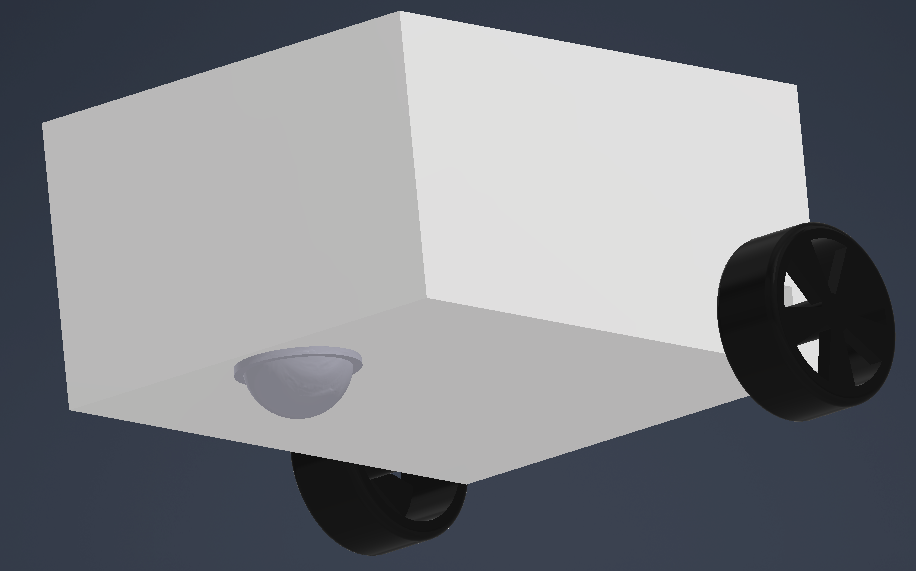

# LiRover Journal

Trying to actually keep this updated as we go instead of writing it all after the fact. Dates below line up with when stuff actually got committed.

## 6/12 (~1 hr) -- repo opened

Started the repo. At this point the plan wasn't LiRover at all, it was a rocket project (there's a "StarPost" folder from this era that stuck around in git history for a couple weeks before we killed it). Mostly just got the repo and a license set up this session.

## 6/17 (~1 hr) -- README pass

Small session, just cleaning up the README for the rocket idea. Nothing structural.

## 6/20 (~3 hrs) -- README rewrite + legal research

Two commits back to back this evening, "Created README" and thated legal requirements" seventeen minutes later. The legalresearch took most of the time here, rockets bring in a lot more regulatory stuff than we'd realized (airspace, motor classification, that kind of thing) and it started to feel like a lot for a hackclub timeline.

## 6/28 (~4 hrs) -- scrapped the rocket, pivoted to the rover

This was the actual pivot. Three commits four minutes apart la11:09 PM): rewrote the README from scratch for the new idea,

Once we landed on it, it also just made things easier: less regulation, cheaper parts, and something we could actually test indoors instead of needing a field.

## 6/29 (~2 hrs) -- project structure

Set up the actual folder skeleton, one commit, 53 files, most of them empty `.gitkeep` placeholders: `cad`, `pcb`, `firmware` (split into `arduino` and `raspberry_pi`, since the Pico and the Pi Zero are doing pretty different jobs), `hardware`, `dashboard`, `docs`, `tests`. Didn't write any actual code this session, just wanted the folders to exist so we weren't arguing about where things go later once we're all in here at the same time.

## 7/7 (~6 hrs) -- the PCB

This was the big one. Before this the board only existed as a sketch on paper and a lot of talking. This session we actually sat down in KiCad and laid it out for real, then merged it back into main (that merge — "Ress kind of messy, there'd been parallel work happening and weended up resolving a chunk of conflicts by hand instead of a clean merge, nothing lost, just took longer than it should have).

Board's built around the Pico W, with the Pi Zero's 40-pin header right next to it so the two boards can talk without a rat's nest of jumper wires. Added a 6-pin header for the microSD breakout too, so logging isn't PIO.
instead of soldering the motor and battery leads directly to the board. We're going to be pulling this thing apart constantly over the next few weeks, and re-soldering every time we swap a battery or a motor would've gotten old fast.

Also threw three keepout zones over the Pico: one for the USB cable, one for the antenna, one just labeled "2.4 GHz RF Keep Out" so nobody routes a trace under the wireless section without noticing. These are rough right now, eyeballed off the datasheet instead of the real footprint, so before this goes anywhere near a fab we need to check them against the actual Pico W footprint in KiCad.

Four M3 mounting holes, one in each corner, so the board can actually bolt to the chassis instead of sitting loose.

Gerbers and the BOM folders are both still empty on purpose. Layout is "done for now," not "ready to order."

Also squeezed in an update to the parts list on the README thiects what we're buying now instead of an early guess.

## 7/8 (~9 hrs) -- CAD, the switch housing, and getting it all

**CAD (~4 hrs):** Got `OGPlatform`, `OGRobotBase`, and `OGRobotRoof` modeled and into the repo. `chassis` / `wheels` / `mounts` are modeled.

**Switch housing (~3 hrs):** Designed and printed a small enclosure for the power switch, a box with a lid that snaps on and a little post on the underside that the pushbutton rests against, so you can hit the switch without any bare wiring exposed underneath. First print fits close, but we haven't test-fit it against the real board yet, just the loose parts.

**Images + final merge (~2 hrs):** Got reference photos of the PCB and the CAD render into the README so it's not just walls of text, plus a last merge to sync everything back to main.

Worth being honest that not everything is in the git log — sourcing/pricing parts, comparing LiDAR options before settling on the TF03, and general back-and-forth deciding on the pivot direction all ate real hours that never turned into a commit by themselves.

**Running total: ~32 hrs as a group so far.**

## What's not started yet

Firmware is empty on both the Pico and the Pi side (`main.ino`es). The dashboard folder (frontend and backend) is empty.`hardware/pinouts` and `hardware/wiring` don't have anything in them. None of the test folders have real tests yet. Basically everything past "the board and chassis exist" is still ahead of us.

## Next up

Wiring in the IMU and encoders now that the connectors are mostly locked in. Double-checking the RF/USB/antenna keepouts against the real Pico W footprint before we even think about ordering the board. Sorting the loose CAD files into their actual subfolders. And then actually starting firmware, since right now we've got a board and a chassis and basically zero code running on either.