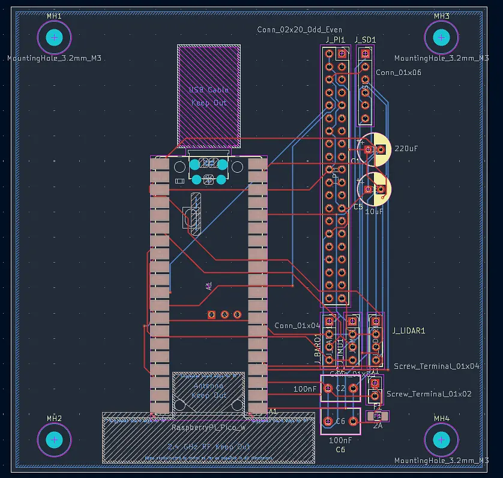
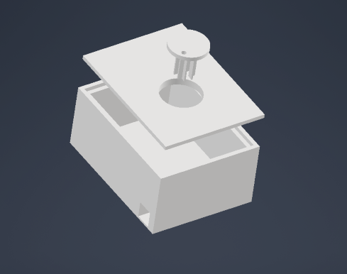

# LiRover, Curated by Alex, Anish, Om, Yash

## Overview

Welcome to LiRover! This hardware for Hackclub's Stardance event will be centered around a hardware initiative by 4 high schoolers.

After a failed rocket idea, we settled on an RC car with a LiDAR sensor attached that can create a comprehensive map of its surroundings. This is done from scratch by creating a 3D printed chassis, custom PCB, and an embedded control system. This project is controlled through a Raspberry Pi Zero 2 W and a Raspberry Pi Pico W. The robot will combine LiDAR sensing, an IMU (which includes an accelerometer for linear acceleration, gyroscope for measuring angular rotation, and magnetometer for magnetic field and acting as a compass), motor drivers, and wheel odometry to estimate its position and generate a real-time 2D "minimap" of its surrounding area. To control it, we implemented a Bluetooth module for SLAM development (Simultaneous Localization and Mapping, essentially enabling the robot to construct a map and track its position).

---

## Features

- Custom CAD and 3D-printed chassis for the RC car
- Custom PCB with onboard power regulation, fusing, and dedicated LiDAR/motor connectors
- Bluetooth remote control
- Real time LiDAR mapping
- IMU-based tracking
    - Accelerometer for linear acceleration
    - 3-plane gyroscope for angular rotation
    - Magnetometer for magnetic field detection

---

## Hardware

### Computing
- Raspberry Pi Zero 2 W
- Raspberry Pi Pico W

### Sensors
- 2D/3D Lidar
- IMU
- Wheel Encoders (??)

### Electronics
- Custom PCB (Pico W + Pi Zero 2 W header, LiDAR connector, screw terminals for motor/battery)
- Motor driver
- Lithium Battery Pack
- Voltage regulation circuitry
- Bluetooth module
- Onboard fuse protection

### Mechanical
- Fully custom 3D-printed chassis
- Custom motor mounts
- 3D-printed power switch housing

---

## Software

### Raspberry Pi Zero 2 W
- Sensor fusion
- Mapping
- Localization
- Bluetooth comms
- Dashboard server
- Robot logic / Robot comms

### Raspberry Pi Pico W (*Communicates with the Raspberry Pi Zero 2 W*)
- Sensor reading
- Motor Pulse Width Modulation (PWM)
- Encoder Feedback

---

## Project Goals

- Design and develop a complete robotics platform
- Develop an embedded control system
- Generate a live 2D map using LiDAR and motion estimation (Main goal!!!)

---

<picture>
  
</picture>

<picture>
 
</picture>

---

## Parts List

Full sheet with more detail/tracking: [LiROS Stardance Materials Sheet](https://docs.google.com/spreadsheets/d/1sdS0OlM2zuOV2pPiHsO394o92J3veeRa5HE5x8mnFqY/edit?gid=0#gid=0)

| Item | Link | Price |
|---|---|---|
| Arduino Uno R3 (Elegoo Super Starter Kit) | - | $42.99 |
| Arduino to USB-A Cable | - | $5.99 |
| Assorted wires (Male-Male, Male-Female, Female-Female) | - | $6.59 |
| Raspberry Pi Zero 2 W | - | $15.00 |
| Raspberry Pi Pico W | - | $6.00 |
| LiDAR (Benewake TF03-180, used, UART) | - | $82.00 |
| [SparkFun 9DoF IMU Breakout - ISM330DHCX + MMC5983MA](https://www.digikey.com/en/products/detail/sparkfun-electronics/19895/16672285) (accel/gyro/mag) | DigiKey | $45.74 |
| [Adafruit BMP388 Precision Barometric Pressure Sensor](https://www.digikey.com/en/products/detail/adafruit-industries-llc/3966/9685338) | DigiKey | $9.95 |
| [Adafruit MicroSD SPI/SDIO Breakout Board](https://www.digikey.com/en/products/detail/adafruit-industries-llc/4682/12822319) | DigiKey | $3.50 |
| [Pololu 5V Step-Up Voltage Regulator (U1V11F5)](https://www.pololu.com/product/2562) | Pololu | $7.95 |
| Battery holder (2-pack, 8x AA, 12V) | [Amazon](https://www.amazon.com/LAMPVPATH-Battery-Holder-Leads-Double-batteries/dp/B07KVHMQRH) | $8.57 |
| Continuous rotation servo (for LiDAR spin) | [Amazon](https://www.amazon.com/Wishiot-TD-8135MG-Digital-Waterproof-500%CE%BCs-2500%CE%BCs/dp/B08JCVLSCK) | $28.94 |
| Motor driver (Toshiba TB6612FNG) | [Amazon](https://www.amazon.com/DIANN-TB6612FNG-Stepper-Driver-Module/dp/B0BLRSWTLM) | $8.39 |
| Bluetooth module (Arduino to Dabble app) | - | $10.00 |
| Gear motors (2-pack, N30 micro, 12V) | [Amazon](https://www.amazon.com/BRINGSMART-Micro-Gearbox-Diameter-Reduction/dp/B0GWQVLZFF) | $17.58 |
| Gear motor wheels | [Amazon](https://www.amazon.com/ThtRht-Motor-Wheels-Replacement-Smart/dp/B0CG1C7T8J) | $10.00 |
| Caster wheel (360° mobility) — order after confirming gear motor wheel height | - | $17-25 |
| Batteries (AA, pack) | [Amazon](https://www.amazon.com/Energizer-Batteries-Pack-Double-Alkaline/dp/B0D51LH5Y5) | $12.00 |
| DROK LM2596 buck converter (logic-level 5V step-down) | [Amazon](https://www.amazon.com/DROK-Display-LM2596-Buck-Converter/dp/B019RKVMKU) | ~$8-10 |

Accelerometer isn't a separate line item since it's already part of the IMU. Shipping/tax pushes the real cost of the DigiKey and Pololu items up a bit further: the three DigiKey sensors run $59.19 subtotal + $8.49 shipping + $4.31 tax + $0.28 tariff = **$72.27** total, and the Pololu regulator runs $7.95 + $6.95 S&H = **$14.90** total.

**Itemized subtotal:** ~$346-356
**With shipping and tax factored in:** ~$366-376
**Estimated total w/ contingency, misc:** ~$366-376

---

## Repository Structure

_Coming Soon!!_

---

## Devlog

Check out [JOURNAL.md](./JOURNAL.md) for build progress and updates.

---

## License

This project is licensed with the MIT License.
